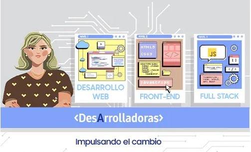
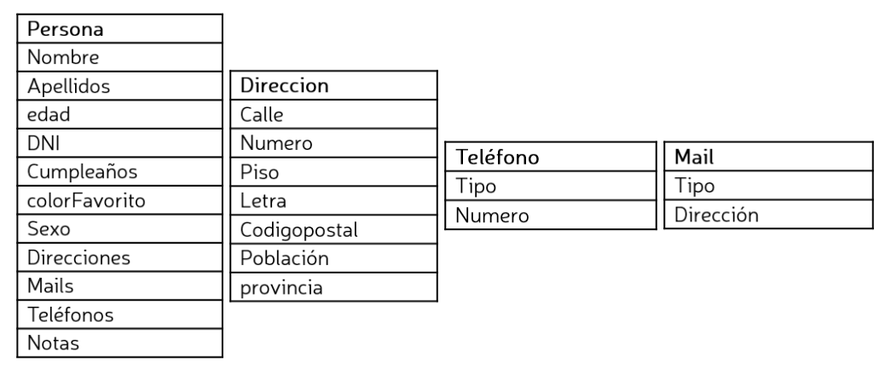

# 💻 Samsung Developer Women

# 🏛️ Bejob - Camilo Jose Cela University

## 📜 Full Stack Development. Level 3. Ed 2022

### 🎓 Typescript Lab: Typescript Agenda 📝

## 🤵 Mentor

Angel Garcia Lupiañez

## ✍ Instructions

1. Develop the following classes to show an agenda with personal details such as: Addresses, phones, emails:

2. Select the right types and functions to access the attributes

3. Create a main module named main where use the classes to create 3 records to show them in terminal trough `console.log` by using the defined functions to get the data.

4. Modify a record fetching it by DNI and adding a new address, new email, and new phone. These changes should be make by using the methods defined previously.

5. Show 3 records from the main module with the changes made previously

### 🛠 Tools

| Tool | Version |
| ---- | ------- |
|TypeScript|4.6.2|
|JavaScript|ES6  |

### 📑 How to use it

- Transpile with the command: `tsc -t es5 main.ts` in the terminal
- Then, type `node main.js` in the terminal and you will see the records

### 🔑 License

- [MIT License](LICENSE)
